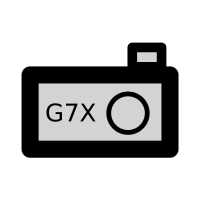

# photo-sorter.py 

|master|develop|
|:---:|:---:|
|[](https://gitlab.namibsun.net/namibsun/python/photo-sorter/commits/master)|[](https://gitlab.namibsun.net/namibsun/python/photo-sorter/commits/develop)|




This is a python script to automatically sort photos from a Canon camera.
In principle, this should also work with other directories containing
images, but it is primarily done for the **Canon Powershot G7 X**'s
image structure.

The script assumes a directory structure like this;

    - DCIM
    -- images&videos_1
    -- images&videos_2
    -- ...
    -- images&videos_n
    -- CANONMSC (optional, will be deleted)

## What does the script do?

### 1. Set up new folder structure

First, it will create a new directory structure like so:

    - DCIM
    -- Images
   	--- Raw
   	--- High Quality
   	--- Low Quality
   	-- Videos

and move all relevant image and video files in the directories.

* Raw files (.CR2) will be put into the ```Images/Raw``` directory
* JPG files will be put into the ```Images/High Quality``` directory
* MP4 files will be put into the ```Videos``` directory

### 2. Look for missing JPG files

If Raw files exist without a corresponding JPG file, the .CR2 file's
preview image will be extracted and equiped with the same exif data as
the .CR2 file and stored in the ```Images/High Quality``` folder.

### 3. Rename according to exif data

All image files will be renamed according to their exif timestamp. The 
file names will follow the format ```YY-MM-DD---hh-mm--ss```

### 4. Create lower quality JPG files

All High Quality JPG files are converted down to ~1080p (1920x1080 / 1080x1920)
and put into the ```Images/Low Quality``` folder

### Optional: Merge

If more than one directory is passed as an argument, These directories are first
processed with Steps 1-4 indivdually and then merged. The resulting folder will
be called ```Merged```

## How do I use this script?

Just call the script using
```photo-sorter <directory 1> <directory 2> ... <directory n>```.

This will process each directory individually and then merge them together.

### Dependencies:

The following commands need to be installed and in the system's PATH:

* ```exiftool```
* ```jpegoptim```
* ```convert``` (Part of ```imagemagick```)

To install these on Arch Linux, run the following command:

    sudo pacman -S imagemagick jpegoptim perl-image-exiftool

Installation on other distributions may differ.

## Further Information

* [Changelog](CHANGELOG)
* [License (GPLv3)](LICENSE)
* [Gitlab](https://gitlab.namibsun.net/namibsun/python/photo-sorter)
* [Github](https://github.com/namboy94/photo-sorter)
* [Progstats](https://progstats.namibsun.net/projects/photo-sorter)
* [PyPi](https://pypi.org/project/photo-sorter)